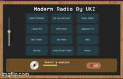

# Modern Radio Player by UKI

## Description

A simple Python radio player with a modern UI, allowing users to stream online stations and control playback.

## Features

- **Stream multiple radio stations**: Listen to a variety of online radio stations.
- **Volume control**: Adjust the volume with an easy-to-use vertical slider.
- **Playback control**: Play or pause radio streams with a single button.
- **Progress bar**: Track playback progress visually.
- **Drag functionality**: Move the window freely on the screen.
- **Modern UI**: A sleek interface built using `customtkinter` for a smooth user experience.

## Requirements

The project requires the following Python libraries:

- `customtkinter==5.2.0`
- `requests==2.28.2`
- `python-vlc==3.0.211`
- `Pillow==9.2.0`

To install these dependencies, run:

## Installation

1. Clone or download the repository.
2. Navigate to the project directory.
3. Install the necessary dependencies by running the following command:

4. Run the application:

## Usage

1. Select a radio station from the list displayed on the main window.
2. Click the **Play** button to start streaming the selected station.
3. Adjust the volume with the slider.
4. Pause or resume playback using the **Play** button.
5. Exit the application by clicking the **Off** button.

## Customization

- Modify the `load_stations()` method to add or remove radio stations.
- Change the background image and button icons by updating the corresponding image files.

## License

This project is licensed under the MIT License - see the [LICENSE](LICENSE) file for details.

## Acknowledgments

- The application uses `vlc` for media playback and `customtkinter` for creating the graphical user interface.
